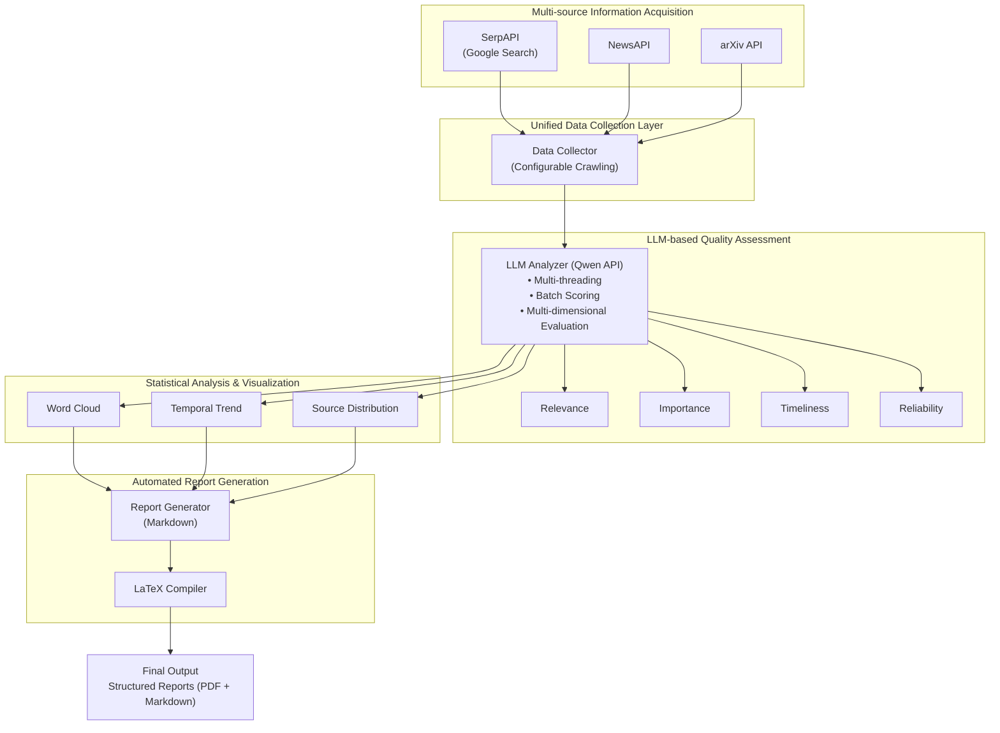

# ZhiLan — A LLM-powered Intelligent Information Aggregation and Analysis System

[TOC]

## System Architecture Overview

```
┌─────────────────────────────────────────────────────────────────────┐
│                         ZhiLan System Pipeline                       │
├─────────────────────────────────────────────────────────────────────┤
│  ┌──────────────┐   ┌──────────────┐   ┌──────────────┐            │
│  │   SerpAPI    │   │   NewsAPI    │   │    arXiv     │            │
│  │(Google Search)│   │              │   │              │            │
│  └──────┬───────┘   └──────┬───────┘   └──────┬───────┘            │
│         │                  │                  │                     │
│         └──────────────────┼──────────────────┘                     │
│                            ▼                                        │
│                  ┌─────────────────────┐                           │
│                  │  Data Collector     │                           │
│                  │  (Multi-source)     │                           │
│                  └──────────┬──────────┘                           │
│                             ▼                                       │
│                  ┌─────────────────────┐                           │
│                  │  LLM Analyzer       │                           │
│                  │  (Qwen API)         │                           │
│                  │  - Multi-threading  │                           │
│                  │  - Batch Scoring    │                           │
│                  └──────────┬──────────┘                           │
│                             ▼                                       │
│         ┌───────────────────┼───────────────────┐                  │
│         ▼                   ▼                   ▼                  │
│  ┌────────────┐     ┌────────────┐     ┌────────────┐             │
│  │ Visualizer │     │  Report    │     │   LaTeX    │             │
│  │ (Charts)   │     │ Generator  │     │  Compiler  │             │
│  └────────────┘     └────────────┘     └────────────┘             │
│         │                   │                   │                  │
│         └───────────────────┼───────────────────┘                  │
│                             ▼                                       │
│                  ┌─────────────────────┐                           │
│                  │   Output Reports    │                           │
│                  │  (Markdown + PDF)   │                           │
│                  └─────────────────────┘                           │
└─────────────────────────────────────────────────────────────────────┘
```

---

## 1. Introduction & Motivation

> **Keywords:** Information Overload, Manual Survey, Research Assistant, Automation

In the era of information explosion, researchers and decision-makers face **information overload**.

Useful information is scattered across:
- Search engines (Google, Bing)
- News platforms (BBC, Reuters, TechCrunch)
- Academic repositories (arXiv, IEEE)
- Industrial blogs and reports

Traditional workflow relies on **manual retrieval, screening, and summarization**, which is time-consuming and cognitively expensive.

> **Core Question:** Can we build an automated research assistant that performs information acquisition, evaluation, analysis, and reporting in an end-to-end manner?

**ZhiLan** is our systematic answer to this question.

---

## 2. System Objective

ZhiLan constructs an **end-to-end automated research pipeline**:

| Stage | Description |
|:------|:------------|
| 1. Collection | Multi-source data acquisition |
| 2. Scoring | LLM-based multi-criteria quality assessment |
| 3. Analysis | Statistical and semantic data analysis |
| 4. Visualization | Charts and word clouds generation |
| 5. Report | Structured Markdown and PDF generation |

**Transform:** Unstructured web-scale information → High-quality structured analytical reports

---

## 3. Module Details

### 3.1 Multi-source Information Collection (`data_collector.py`)

> **Supported Sources:** SerpAPI (Google), NewsAPI, arXiv

| Source | Content Type | Configuration |
|:-------|:-------------|:--------------|
| SerpAPI | Web search results | `google_domain`, `gl`, `hl`, `num` |
| NewsAPI | News articles | `language`, `sort_by`, `page_size` |
| arXiv | Academic papers | `max_results`, category filters |

All crawling behavior is **fully configurable via Hydra** (`conf/config.yaml`).

### 3.2 LLM-based Intelligent Screening (`analyzer.py`)

> **Core Innovation:** LLM-as-a-Judge with multi-dimensional scoring

**Scoring Dimensions:**

| Dimension | Weight | Description |
|:----------|:------:|:------------|
| Relevance | 30% | Topic relevance score |
| Importance | 30% | Information significance |
| Timeliness | 20% | Recency of information |
| Reliability | 20% | Source credibility |

**Formula:** `score = 0.3×relevance + 0.3×importance + 0.2×timeliness + 0.2×reliability`

**Engineering Features:**
- Multi-threaded parallel scoring (5 workers by default)
- Batch processing (10 items per batch)
- Rich progress bar visualization
- Automatic retry on API failures

### 3.3 Data Visualization (`visualizer.py`)

| Chart Type | Description |
|:-----------|:------------|
| Word Cloud | Keyword frequency visualization |
| Timeline | Temporal trend analysis |
| Source Distribution | Pie chart of information sources |
| Score Distribution | Histogram of quality scores |

### 3.4 Report Generation (`report_generator.py`)

**Report Sections:**
1. Executive Summary (执行摘要)
2. Key Events (重点事件解读)
3. Overall Analysis (智览总体分析)
4. Trend Analysis (趋势分析)
5. Statistics & Visualization (数据统计与可视化)
6. Recommendations (相关建议)
7. Appendix (附录)

**Report Styles:**
- `brief` - 简明新闻风格
- `detailed` - 深度分析风格 (default)
- `academic` - 学术刊物风格

### 3.5 LaTeX Compilation (`latex_compiler.py`)

- Markdown → LaTeX conversion
- XeLaTeX/PDFLaTeX compilation
- Template-based formatting (`templates/report_template.tex`)

---

## 4. Configuration System

### Hydra Configuration Structure

```
conf/
├── config.yaml      # Main configuration
└── api/
    └── default.yaml # API keys (gitignored)
```

### Key Configuration Options

```yaml
collection:
  topics: ["nlp developments", "Google", "Nvidia"]
  time_range: "last_3_days"
  max_items_per_topic: 30

analysis:
  min_score: 0.6
  
report:
  style: "detailed"
  sections: [executive_summary, key_events, overall_analysis, ...]
```

---

## 5. Output Structure

Each run creates a timestamped directory:

```
outputs/
└── 2025-12-23/
    └── 14-30-00/
        ├── .hydra/           # Configuration snapshot
        ├── zhilan.log        # Execution log
        └── results/
            ├── assets/
            │   ├── wordcloud.png
            │   ├── timeline.png
            │   ├── source_distribution.png
            │   └── score_distribution.png
            ├── report_20251223_143000.md
            └── report_20251223_143000.pdf
```

---

## 6. Engineering Highlights

### 6.1 Configuration Management (Hydra + OmegaConf)

```yaml
# Hierarchical configuration with defaults
defaults:
  - api: default
  - _self_

collection:
  topics: ["AI", "ML"]
  time_range: "last_3_days"
```

- **Hierarchical config structure**: Modular YAML files under `conf/`
- **Runtime override**: `python main.py collection.topics="[GPT, Claude]"`
- **Auto-versioning**: Each run saves config snapshot to `.hydra/`

### 6.2 Logging & Error Handling (`logger.py`)

```python
# Decorator-based error handling
@retry_on_failure(max_attempts=3, backoff_factor=2.0)
@handle_exceptions
def api_call():
    ...
```

| Feature | Implementation |
|:--------|:---------------|
| Unified Logger | `logging.getLogger(f"智览系统v{version}")` |
| File + Console | Dual output with colored console logs |
| Retry Mechanism | Exponential backoff for API failures |
| Exception Decorator | `@handle_exceptions` for graceful degradation |

### 6.3 Multi-threaded Parallel Scoring (`analyzer.py`)

```python
# Parallel batch processing with progress visualization
with ThreadPoolExecutor(max_workers=5) as executor:
    for batch in batches:
        executor.submit(score_single_batch, batch, ...)
```

| Parameter | Value | Description |
|:----------|:-----:|:------------|
| `batch_size` | 10 | Items per LLM API call |
| `max_workers` | 5 | Concurrent threads |
| Progress Bar | Rich | Real-time multi-worker status |

### 6.4 Reproducibility & Output Management

```
outputs/
└── 2025-12-23/
    └── 14-30-00/
        ├── .hydra/           # Config snapshot (reproducible)
        │   ├── config.yaml
        │   ├── hydra.yaml
        │   └── overrides.yaml
        ├── zhilan.log        # Full execution log
        └── results/          # All outputs
```

- **Timestamped directories**: Auto-organized by date/time
- **Config preservation**: Full config saved for each run
- **Isolated outputs**: No cross-run contamination

### 6.5 Modular Pipeline Architecture

```
┌─────────────┐    ┌─────────────┐    ┌─────────────┐
│ ConfigManager│───▶│DataCollector│───▶│  Analyzer   │
└─────────────┘    └─────────────┘    └─────────────┘
                                            │
        ┌───────────────────────────────────┘
        ▼
┌─────────────┐    ┌─────────────┐    ┌─────────────┐
│ Visualizer  │───▶│ReportGenerator│──▶│LaTeXCompiler│
└─────────────┘    └─────────────┘    └─────────────┘
```

| Module | Responsibility | Replaceable |
|:-------|:---------------|:-----------:|
| `config.py` | Configuration parsing | ✓ |
| `data_collector.py` | Multi-source crawling | ✓ |
| `analyzer.py` | LLM scoring & filtering | ✓ |
| `visualizer.py` | Chart generation | ✓ |
| `report_generator.py` | Markdown report | ✓ |
| `latex_compiler.py` | PDF compilation | ✓ |

### 6.6 Technology Stack Summary

| Layer | Technology |
|:------|:-----------|
| **Config** | Hydra 1.3 + OmegaConf |
| **HTTP** | Requests + urllib3 |
| **LLM** | Qwen API (DashScope) |
| **Concurrency** | ThreadPoolExecutor |
| **Visualization** | Matplotlib + Seaborn + WordCloud |
| **Progress UI** | Rich (multi-progress bars) |
| **Templating** | Jinja2 |
| **PDF** | XeLaTeX + ctex |
| **Logging** | Python logging + colorlog |

---

## 7. Demo & Results

### Sample Output Statistics

| Metric | Value |
|:-------|------:|
| Total collected items | ~90 |
| High-quality items (score ≥ 0.6) | ~35 |
| Average quality score | 0.75 |
| Information sources | 3 |
| Time span | 3 days |

---

## 8. Future Work

- [ ] Web-based interface (Streamlit/Gradio)
- [ ] Scheduled periodic survey (cron job)
- [ ] Multi-modal image analysis
- [ ] Long-term trend database (SQLite/PostgreSQL)
- [ ] Email notification for completed reports

---

## 中文版本

### 系统简介

**智览**是一个基于大语言模型的智能信息聚合与分析系统，实现从多源信息采集到高质量分析报告生成的全流程自动化。

### 核心功能

1. **多源采集** - 整合 SerpAPI、NewsAPI、arXiv 三大数据源
2. **智能评分** - 基于 LLM 的四维度质量评分（相关性、重要性、时效性、可靠性）
3. **可视化** - 自动生成词云、趋势图、来源分布图等
4. **报告生成** - 支持 Markdown 和 PDF 两种格式

### 技术栈

| 模块 | 技术 |
|:-----|:-----|
| 配置管理 | Hydra + OmegaConf |
| 数据采集 | Requests + BeautifulSoup |
| 智能分析 | 通义千问 API (qwen3-max) |
| 可视化 | Matplotlib + Seaborn + WordCloud |
| 报告生成 | Jinja2 + LaTeX |

### 运行方式

```bash
# 激活环境
conda activate zhilan

# 运行系统
python src/main.py

# 自定义主题
python src/main.py collection.topics="[人工智能, 机器学习]"
```

---

*本报告由智览系统生成*



